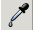
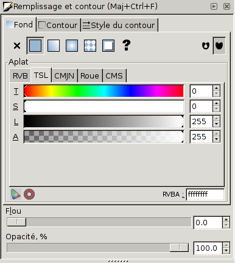

# Les couleurs

- La liste des couleurs au bas de la fenêtre permet de choisir les couleurs des objets: un clic sur une couleur défini la couleur de fond de de l'objet courant et un clic avec la touche majuscule enfoncée défini son contour.
- Le menu contextuel à la droite de la liste de couleurs permet de configurer leur nombre et la façon dont ils sont affichés.
- La pipette  permet d'appliquer à l'objet courant la couleur d'un autre objet.
-  Dans la palette des _Remplissages et contours_ vous trouvez un résumé des caractéristique de l'objet courant et vous pouvez appliquer des valeurs spécifiques.

> Attention: Les _dégradés_ sont un moyen efficace pour donner du dynamisme à dessins, mais ils cachent aussi des dangers: les couleurs étant calculés automatiquement, le résultat à l'impression ne correspond pas toujours à l'aperçu à l'écran et ils ne sont pas toujours interprétés correctement par les imprimeurs. À utiliser avec parcimonie.
