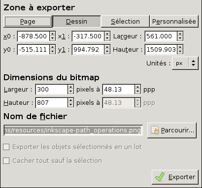

# Output pour le web et l'impression

Les fichiers de travail d'Inkscape sont enregistrés au format SVG, avec des extensions spécifiques.

Lorsque vous souhaitez utiliser le résultat de votre travail dans un autre logiciel ou le transmettre à une personne pour qu'il l'intègre dans son travail, vous avez plusieurs options selon la nature de votre œuvre et les caractéristiques de l'utilisation.

## Export vectoriel en SVG standard

Un nombre croissant de logiciels peuvent lire le format standard SVG. Il est notamment possible de visualiser les fichiers SVG dans les browser web.

Pour exporter votre fichier, vous n'avez qu'à lancer la commande _Fichier &gt; Enregistrer une copie..._ et choisir le format _SVG simple_

Soyez prudents: le support n'est pas toujours complet. Assurez-vous donc que vos fichiers sont lisibles pour votre autre logiciels ou public cible. Notamment, les versions plus anciennes des browsers ne supportent pas les images en SVG et Scribus peut avoir de la peine à lire correctement certains fichiers.

## Export vectoriel en PDF

Exportez vos fichiers en  PDF lorsque vous souhaitez gardes vos dessins en vectoriel mais vous n'avez pas de contrôle sur qui va les lire et avec quel logiciel.

Pour exporter votre fichier en PDF, lancez la commande _Fichier &gt; Enregistrer une copie..._ et choisir le format _PDF_.

Parmi les options proposées, nous vous conseillons de choisir la version de PDF 1.4, de convertir les textes en chemins et de rasteriser les effets de filtre.

Vous avez la possibilité d'exporter toute la page ou la surface contenant le dessin.

Il est vivement recommandé de tester le PDF avec plusieurs lecteur de PDF et de vous assurer qu'il ne contient 'aucune faute de rendu.

## Export bitmap en PNG

La solution la plus sûre pour exporter votre travail et de l'exporter en bitmap: lancez la commande _Fichier &gt; Exporter en bitmap..._ et choisissez le dossier et le nom du fichier qui mieux vous conviennent.

Lors de l'exportation vous pouvez choisir si vous souhaitez exporter toute la page, le dessin complet, la sélection courante ou une surface personnalisée.

L'option la plus important est la dimension du bitmap: la valeur que vous définissez déterminera la résolution de l'image exportée (attention: les _ppp_, points pas pouce, dans le champ de droit sont donné uniquement à titre indicatif et n'influencent nullement la qualité de l'image). Si exportez un fichier pour l'envoyer à l'imprimerie, vous allez devoir veiller à ce que la taille soit suffisante pour une impression impeccable. Si par contre vous souhaitez le publier sur internet vous allez choisir les dimensions minimales pour une rendu de qualité à l'écran (en règle générale vous n'allez pas dépasser les 600 pixels en horizontale).

> Pour redéfinir la taille du document, ouvrez _Fichier &gt; Propriétés du document..._, ouvrez l'option _Redimensionner la page au contenu..._ dans la section _Dimensions personnalisées_  et cliquez sur le bouton _Ajuster la page au dessin ou à la sélection_.
