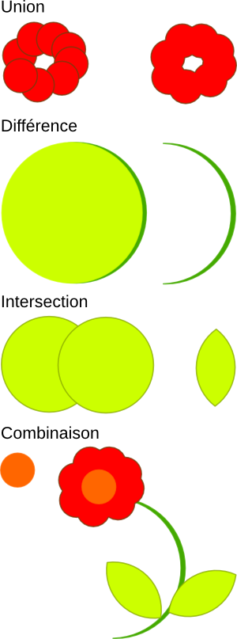

# Combinaisons de formes

Il est possible dessiner

- La _Combinaison_  de chemins est une liaison réversible de chemins. Les nœuds appartiennent à leur formes respectives et vous pouvez les séparer à nouvueau.
- L'_Union_ remplace les objets sélectionnés par un objet dont la surface en est la somme.
- La _Différence_ entre deux objets découpe la forme de l'objet en premier plan dans celle qui lui est derrière
- L'_Intersection_ entre deux objets remplace les objets sélectionnés par la surface qu'ils ont en commun.

> Les opérations cartésiennes sont irréversibles: nous vous conseillons de les appliquer à des copies de vos objets. Vous pouvez ainsi essayer de nouvelles variantes sans devoir faire des aller-retour avec annuler et rétablir.
