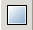

# Formes de base et lignes

Formes:

-  Rectangles
-  Cercles
-  Triangles et autres polygones

Lignes:

-  Courbes de bézier

Édition:

-  Sélectionner, transformations et rotation
-  Édition de nœuds et de formes
