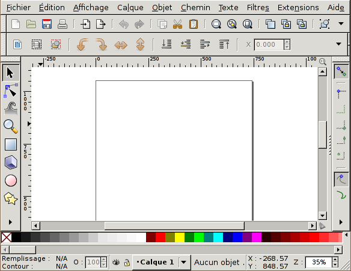

# Interface

## La fenêtre principale

- La _barre d'outils_ sur la gauche permet d'activer les outils qui créent et manipulent les objets.
- La _barre de commandes_ juste en dessous des menus permet d'exécuter des actions sur le document ou les objets.
- La _barre des contrôles d'outils_ en dessous de la barre de commandes s'adapte automatiquement à l'outil activé et permet de configurer les outils.
- La _barre des contrôles du magnétisme_ permet de définir comment les nœuds sont aimantés entre eux, aux formes et à la grille.
