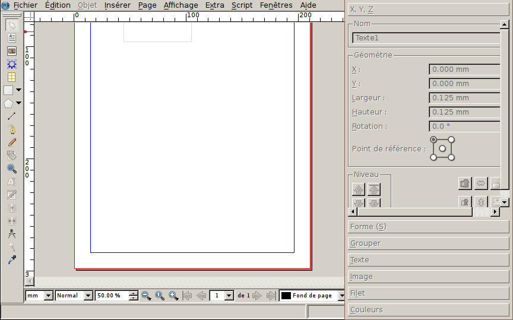

# L'interface

Nous vous conseillons de:

- Mettre Scribus en plein écran.
- Cacher les barres "Fichier", "Modifier" et "Outils PDF" par un clic droit de la souris sur une partie "vide" de la barre. Vous pourrez les afficher à tout moment par un clic droit sur la barre même.
  - Si par malheur, vous avez caché toutes les barres, vous pouvez afficher à nouveau la barre d'outils en activant la dernière option dans le menu "Fenêtre".
  - Si la barre devient "flottante", glissez la sur le bord de la fenêtre principale de Scribus.
- Glisser et ancrer la barre "Outils" sur le bord gauche de la fenêtre.
- Afficher la _palette des propriétés_, la déplacer au bord droit de l'écran, définir son hauteur de façon à remplir l'écran, et – éventuellement – adapter sa largeur pour que son contenu ne déborde pas en horizontale.

Les éléments principaux de l'interface de Scribus sont:

- La _barre d'outils_: chaque outils vous permet de créer ou modifier les objets sur la page.
- La _barre d'état_: fournit de nombreuses informations sur le document et permet un accès à quelques fonctions telles le zoom, la sélection de la page courante et l'activation du mode aperçu.
- Le menu _Fenêtres_ permet d'afficher et cacher les palettes pour gestion du contenu.
- La _palette des propriétés_ est le panneau de contrôle de Scribus: outre que par le menu _Fenêtres_, il est aussi accessible par la touche clavier _F2_ et il permet de formater les textes et les images.
- Enfin, il est important de savoir que les menus permettent d'accéder à toutes les fonctions de Scribus: n'hésitez pas à les essayer pour découvrir toutes les fonctionnalités de Scribus!
